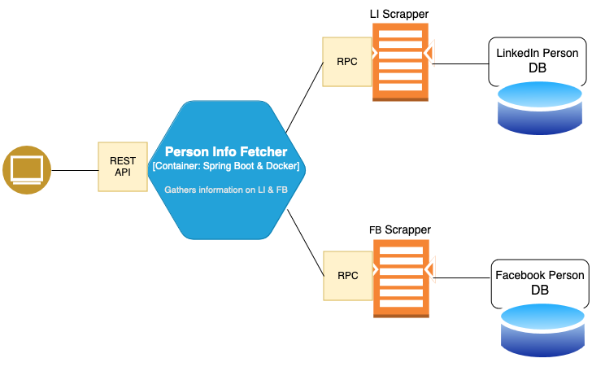

## Software Design Document

### Introduction

It should explain the purpose of the document
the scope of the project
the intended audience

### Project Overview and Goals

provide a high-level summary of the project. 
Describe what the software is intended to do and the problems it aims to solve. 
List the primary goals and objectives, highlighting the key features and functionalities.
outline the project’s timeline, including major milestones and deliverables.

### System Functionality

should list all the functionalities, often broken down into modules or components. 
For each functionality, provide detailed descriptions, user stories, 
or use cases to illustrate how users will interact with the system.


###  Architectural Design

provides a blueprint of the system’s structure. 



Communication types:

Client (a browser) communicates with a Service (Poirot) via HTTP synchronous protocol. A client sends request to 
the server and waits for the response.

We may to use asynchronous protocol, for example AMQP however it is a more complicated and due to the time constraints
we are not going to use it.

Our application separated on two different microservices: a main one - Poirot and second one - mongo db server.

Microservices helps to divide monolith application into separated and manageable services. As benefits, it gives us:
scalability, maintainability and flexibility. Each service becomes more small and easier to deploy, independently.
For example, if we fixed a bug in Poirot, we do not need to redeploy mongo server. 
It also reduces deployment time, make fault recovery more robust.
Another benefit is a testing. Becasue to the nature of microservices the can in less effort test more efficiently.

However, it is also adds overhead representing kind of disadvantages.
For developer, it represents a difficulty to debug system. In case of many microservices it is challenging to get and synchronise
logs from them. 
Data also can be out of consistency, management and integrity. 
To test single microservice is easy, however to test end two end becomes a challenge.

### Detailed Design

Rest controllers

* PersonalInformationFetcher - exposes REST API to get input from the user.

The payload is a json, ```PersonInfoRequest```

```
{
   "firstName":"Jon",
   "lastName":"Snow",
   "email":"jon.snow@gameofthrones.com",
   "phone":"(666) JON-RAVEN",
   "location":"Westeros"
}
```

* Services

LinkedInOps - firstly, performs a search query on DDG (duckduckgo), "site:Linkedin.com 'Jon Snow'". It takes only 5 top
results. This parameter is in Constants, representing a limit. Can be changed. Once a result is gotten, it starts a LI 
personal information scraping. It uses available public LinkedIn profiles. If it is not available we get HTTP status - 999.
It means that request is denied. The possible solution is to use "https://translate.yandex.com/translate", in current
implementation it won't be implemented. When information is received LinkedInPerson.java it transformed to DMO (Data Model Object) and saved
into database as a document.

* Database layer - repositories

Spring Boot CRUD Repository abstracts database operations layer and makes its easier to make operations like: Update, Read,
Create or Delete.


Each module or component should have its own subsection, 
explaining its purpose, functionalities, and internal workings. 
Include class diagrams, sequence diagrams, and other relevant technical drawings.


###

References:

Editorial Team. (n.d.). Software design document: What is it & how to create it! (template included). BIT.AI Blog.
https://blog.bit.ai/software-design-document/

James Montemagno (April, 2022). Communication in a microservice architecture
https://learn.microsoft.com/en-us/dotnet/architecture/microservices/architect-microservice-container-applications/communication-in-microservice-architecture

Atlassian Blog - Advantages of microservices and disadvantages to know
https://www.atlassian.com/microservices/cloud-computing/advantages-of-microservices
