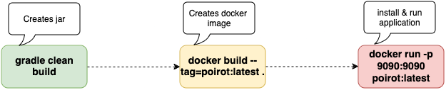
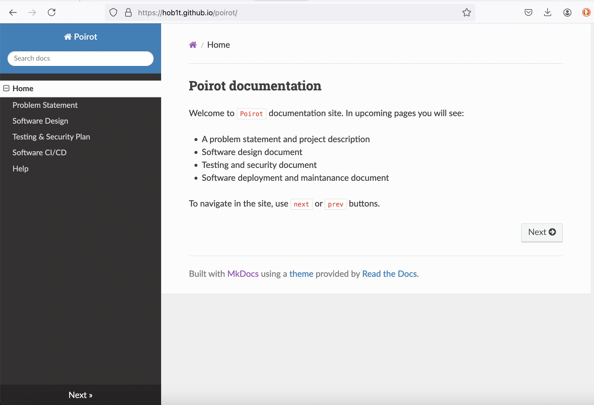
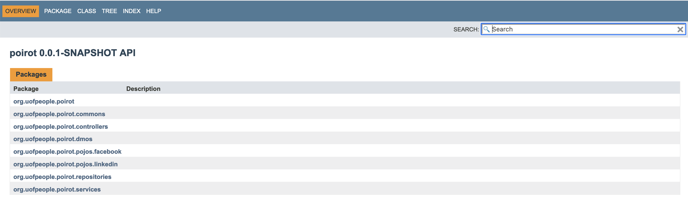

## Software Deployment and Software Maintenance

The CI/CD process looks like:



Application has a configuration file ```application.properties```.

At bootstrap step application reads all required parameters from this file.

```build.gradle``` contains tasks responsible for build, code coverage, testing and code formating.

It also contains dependencies of the application.

#### Version control

We use ```github``` as a repository and tooling and git as a version control. It is defacto version control.

The [link to the repo](https://github.com/hob1t/poirot).

We work with branches. The main one called ```main``` branch. The idea to use branches to make separation of the team 
work and reduce risk of untested work. When all required testing is done, we merge it to the ```main```.

#### Tags & Releases

The entire process presented [here](https://docs.github.com/en/repositories/releasing-projects-on-github/managing-releases-in-a-repository)

In ```Poirot``` project new release is done when milestone is achieved. 

When new release is set up, we created new docker image and redeploy the application.


#### Documentation

Oragui (2024) writes: "Software documentation is a crucial part of working software. Software documentation is 
crucial because it can assist users understand how to use your software, it can provide developers and other 
technical stakeholders with information about the technical aspects of your software, and it can help ensure 
that the software development process is consistent and repeatable.".


Documentation is in md files. We use ```mkdocs``` which generates project's documentation.

* Prerequisites 

```
python3 -m venv doc_venv && source doc_venv/bin/activate && pip install mkdocs 
```

* Configuration file

```mkdocs.yml```

* Building

```
./scripts/mkdocs_build.sh
```

* The documentation is hosted on ```github.com```

```
mkdocs gh-deploy
```




In ```Poirot``` project we also use ```javadoc``` a documentation of the source code.

##### To generate it, simply run

```
gradle javadoc
```




### Deployment Strategies and Maintenance Techniques

Software deployment strategy types include:

* Basic
* Multi-service
* Rolling Deployment
* Blue Green Deployment
* Canary Deployment
* A/B Testing


Why Docker?

It helps us to run our application in isolated environment.

It makes management more easy, if we will use k8s we could easlily to scale up, to scale down.

k8s also checks health check of the microservice, and if it fails it will restart it again.

Before docker we can simply run the following command:

```bash
 gradle clean build
```

And then

```bash 
java -jar build/libs/poirot-0.0.1-SNAPSHOT.jar
```

It is good, but only works locally. 

#### To build docker

```bash
docker build --tag=poirot:latest .
```

#### To run a docker

```
docker run -p 9090:9090 poirot:latest
```


### Effectiveness of Strategies Used


### References

Yiadh TLIJANI (April, 2024) *8 Deployment Strategies Explained and Compared*
https://devopsbootcamp.org/8-deployment-strategies-explained-and-compared/

Slaviša Avramović (January 8, 2024) *Dockerizing a Spring Boot Application*
https://www.baeldung.com/dockerizing-spring-boot-application

Github Managing releases in a repository
https://docs.github.com/en/repositories/releasing-projects-on-github/managing-releases-in-a-repository

Documentation - Creating Project Documentation
https://www.mkdocs.org/

Poirot documentation site
https://hob1t.github.io/poirot/

David, O. (2023, April 26). Software documentation best practices [with examples](https://helpjuice.com/blog/software-documentation). Helpjuice.

Martin, M. (2023, April 8). [Software configuration management in software engineering.](https://www.guru99.com/software-configuration-management-tutorial.html) Guru99.

[Software deployment- definitions and overview.](https://www.sumologic.com/glossary/software-deployment/) (n. d). Sumo Logic. 

[What is a software maintenance process? 4 types of software maintenance.](https://cpl.thalesgroup.com/software-monetization/four-types-of-software-maintenance) (n.d.). Thales. 

