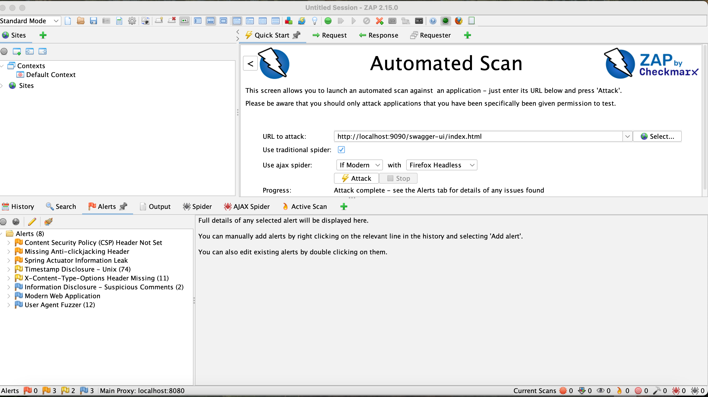

## Testing and Security Document

### Testing

#### Unit testing

This project is developed using TDD (test driven development) methodology. It means, you start developing with test, 
then go to the code. At the end, your code is covered by unit tests.

#### End-2-End testing

Next, is e2e testing. The idea is to run entire system from the start to the end, where a request will pass every flow.
It resembles real system in the production environment.

#### Load testing

It puts a system into the stress. It helps to find the limits of the system.

#### REST API to be under the test


#### Code Coverage

The quality is not only functionality that works. It is also relates to the code coverage. What percentage
of our code covered by tests. I use Jacoco as code coverage checker.


#### Code Style

Sloppy or smelly code contains hidden bugs which is really difficult to find. Gradle introduces task called
```spotless``` which removes unused imports, reformats code and even more.


### Security 

"Basic security goals such as confidentiality, integrity, and availability." (Alenezi, 2019).
He also adds: "Hacking, Denial of services, virus, fire, and power loss are sources of systematic
risk. Whereas, unsystematic risk is the portion of total risk that is unique to the enterprise. 
Data loss or misuse, human error, application error, and inside attack can be examples for
unsystematic risk."

In poirot I did ZAP testing. Endpoint was: ```http://localhost:9090/swagger-ui/index.html```. Here are the results:




In addition, added gradle OWASP dependency-check tasks.

Results as following:

```
> Task :dependencyCheckAnalyze
Verifying dependencies for project poirot
Checking for updates and analyzing dependencies for vulnerabilities
An NVD API Key was not provided - it is highly recommended to use an NVD API key as the update can take a VERY long time without an API Key
Generating report for project poirot
Found 0 vulnerabilities in project poirot
```


#### Risk Management

Possible Risks:

* Database is not reponsding to responding very slow

* DuckDuckGo prevents to make searches

* FB page scrapper returns "Session is not valid"

Our application should implement Zero Trust paradigm, which basically means each request represents potential
danger. 


### References:

Mario Casari (July, 2024) *How to Perform Load Testing in Spring Boot with Gatling*
https://www.freecodecamp.org/news/how-to-integrate-spring-boot-with-gatling/

Alenezi, M., & Almuairfi, S. (2019). *Security risks in the software development lifecycle. 
International Journal of Recent Technology and Engineering* (IJRTE), 8(3), 22773878.
https://www.ijrte.org/wp-content/uploads/papers/v8i3/C5374098319.pdf
