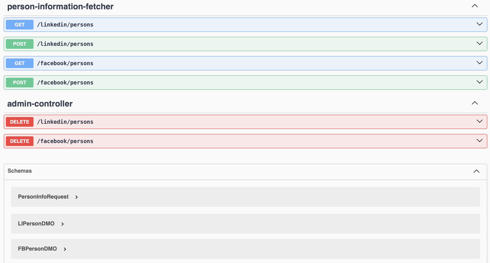
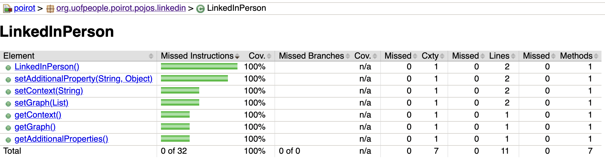

## Testing and Security Document

### Testing

#### Unit testing

This project is developed using TDD (test driven development) methodology. It means, you start developing with test, 
then go to the code. At the end, your code is covered by unit tests.

#### End-2-End testing

Next, is e2e testing. The idea is to run entire system from the start to the end, where a request will pass every flow.
It resembles real system in the production environment.

#### Load testing

It puts a system into the stress. It helps to find the limits of the system.

#### REST API to be under the test




#### Code Coverage

The quality is not only functionality that works. It is also relates to the code coverage. What percentage
of our code covered by tests. I use Jacoco as code coverage checker.




#### Code Style

Sloppy or smelly code contains hidden bugs which is really difficult to find. Gradle introduces task called
```spotless``` which removes unused imports, reformats code and even more.


### References:

Mario Casari (July, 2024) *How to Perform Load Testing in Spring Boot with Gatling*
https://www.freecodecamp.org/news/how-to-integrate-spring-boot-with-gatling/


