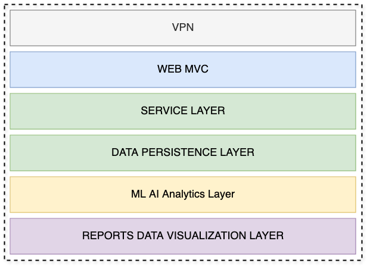
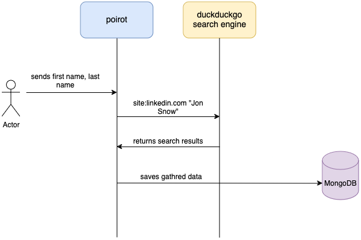

## Project Name

Poirot, like famous detective Hercule Poirot

## High Level design



#### VPN

Gathering person's information not always legally allowed or person's accreditated task. It is quite important to hide
searcher's information. VPN helps to give a solution for this requirement.

Gewirtz (2024) explains: "The purpose of a VPN is to provide you with security and privacy as you communicate over the internet. 
Most of the internet's core protocols (communication methods) were designed to route around failure, rather than secure data. 
While some standards have developed, not all internet apps are secure. Many still send their information without any security 
or privacy protection whatsoever. This leaves any internet user vulnerable to criminals who might steal your banking or 
credit card information, governments who might want to eavesdrop on their citizens, and other internet users who might want 
to spy on you for a whole range of nefarious reasons."

If a researcher logged in into LI account and looks for user's profile, LI notifies a person what a "searcher" was looking his profile.
Using VPN we will hide part of such information. In addition, using Google Dorks we gather information without showing up our identity
to the person of interest.

#### Software requirements

##### Use cases:

As a user I would like to be able to gather person's information on LinkedIn

As a user I would like to be able to gather person's information on Facebook

As a user I would like to persist gathered information into database

As a user I would like to use CRUD repository

As a user I would like to get REST API for CRUD operations

#### Introduction
As part of fight with misinformation, disinformation and fake news detection is one of the required steps are to get knowledge
about person of interest. Existing OSINT tools can bring problems related to security or lack of maintenance. The purpose of this
project to create a suitable solution.
Product scope is having MVC layer, Business layer & Persistence layer. However, it will not have a data analytics and data
visualization layers. 

Functional Requirements

#### External Interface Requirements

User Interface is a Swagger pages which make call to the backend functionality.

#### Non-functional Requirements

Security

Capacity - ideally storage should be dynamically allocated, aws s3 is a good candidate. For the capstone purposes it 
           is enough to have 250Gb.

Compatibility - minimum requirements for hardware are: RAM 8GB, CPU Apple M1, 8 Cores.

Reliability and availability - response for each request should be persisted. DB should have a backup last 24 hours.
                               Each microservice should implement its healthcheck, for cluster management.

Scalability - the minimum number of pods is one, maximum is 3. k8s configured for scale up or scale down.

Maintainability - CI/CD triggered on each commit. In addition, on master merge triggers a redeploy logic.
                  In addition, part of CI process added logic of checking dependencies updates and security code scanning.

Usability - a service exposes Swagger, accepts curl commands as well.


#### Project Resources Resources Identified

A computer a main source of machinery.
Text editor or IDE to write code, edit documentation.
Browser - a firefox or chrome. To surf internet.
Internet connection - to do a research
VPN - for secure connection outside the world. Any VPN is suitable, in my case i use Surfshark.
A person with required skill set (me)
Time - entire project takes 6 weeks, each week is intended to Specific Sprint. A lenght of each Spring is exactly
one week long. 

#### Challenges gathering facebook information

Facebook requires to be registered in order to get user's information. Registration allow to sources to know who is 
gathering information. Our goal to expose as little as possible information for anybody.

So, first we do a google dorks as ```site:facebook.com "John Doe"```. It brings us a search page which we have to scrap.
One of the scapping results is user's profile URL which contains information related to username. Username can be as same
as a user's first and last names or different. In addition, we can also find userID info, which can be useful.

Next challenge is to parse search results and get valuable information. Fortunately, there are a lot of available
libraries which helps us to do it.

During the number of ddg request I got: "Please complete the following challenge to confirm this search was made by a human"
Basically it means I cannot automate web scrapping using current approach.


### Management of Resources

#### Time
The longevity of the project is about 6 weeks. Each week 15 hours of work.

#### Raw materials /software to be used

IDE - Intellij, java 17, python 3, docker, macOS, firefox as a browser, VPN - surfshark

Docker, MongoDB, Spring Boot framework, gradle, docker-compose

Java is good language, I am familiar with it, 17 version is a minimum version that requires Spring Boot.

Docker is a technology which makes possible to run application as a service. Using k8s makes to manage our cluster

of microservices if we need to scale. In general using docker images gives us ability in matter of seconds to redeploy

our application for more newest version.

Gradle is a build tool. To build a project we have two options: maven or gradle. Gradle is more modern building tool.

MongoDB is chosen because it is document database, allows us to save data simply as json file. To use relational database

is not suitable for this kind of project due to the data model. In addition to scale not relational database is much easier

that relational. 

#### Human resources

Me and Professor as mentor and adviser. I am going to implement this project.

#### Machinery and equipment 

MacBook AIR it is what I have.

#### Financial Resources 

A cost of the project is the much as 300 usd.

#### Infomration and data

Using duckduck search engine, Google Scholar and google dorks. Using google requires to be loged in, which not serves
well for our porposes, duckduck is allows to make search queries anonymously. 
Also any information used or looked at mentioned in References.

Gathered information saved in MongoDB.

### Software Requirements and Specification

#### Software Requirements

Should expose REST API in order to get input from the user like first name, last name, email, location
Optional: email, location

Should save gathered information about a person of interest.

Should expose REST API for CRUD operations

Should be implemented as microservice(s) and packeged as a Dockerfile.

Code should be kept in github repository

#### Software Design Document

** Gathering Flow **



**Interface of REST CRUD operations**

**C**reate operation puts a new document/entry into database/collection. 

**R**ead operation gets a document/entry from database/collection

**U**pdate operation changes property(-s) of the document/entry

**D**elete operation deletes a document/entry from the database/collection

**Controllers**

Person's information Gathering Controller

CRUD Controller

**Repositories**

In the world of Spring Boot a repository is an interface which abstracts database operations.

* FaceBook Repository

*List of allowed operations*

Saves a given entity

Gets the entity by ID

Gets all entities by paging

Deletes the given entity


* LinkedIn Repository

**Data Access Objects**

Person

* Location

* Alumni

* Image URL - for reverse search

* First Name

* Last Name

* Phone

* Email

* Follows - a counter

* Connection #

* Works for

* LinkedIn URL

##### If we get status=999
```
!archivemd ${https://www.linkedin.com/in/ashley-hume-5733b345}
https://archive.md/https://www.linkedin.com/in/ashley-hume-5733b345
https://archive.md/https://www.facebook.com/jonsnowandassociates/about
```

or

```
https://translate.yandex.com/translate
```


#### References
David Gewirtz (May 28, 2024). What is a VPN and why do you need one?
https://www.zdnet.com/article/what-is-a-vpn-and-why-do-you-need-one-all-your-virtual-private-network-questions-answered/

Ishan Oshada GDorks github repository
https://github.com/Ishanoshada/GDorks

Spring Boot - data repository
https://docs.spring.io/spring-data/data-commons/docs/1.6.1.RELEASE/reference/html/repositories.html
