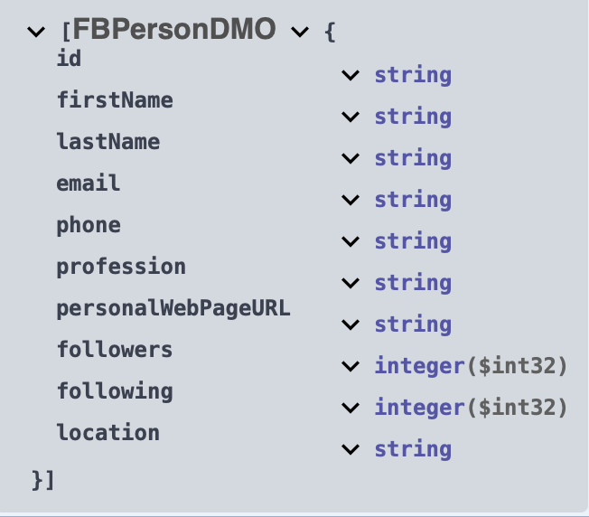
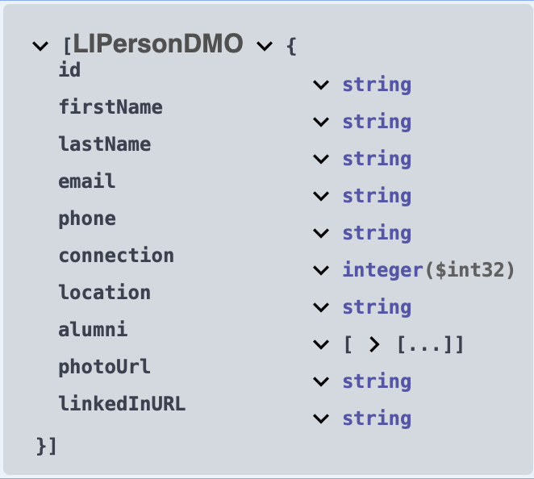
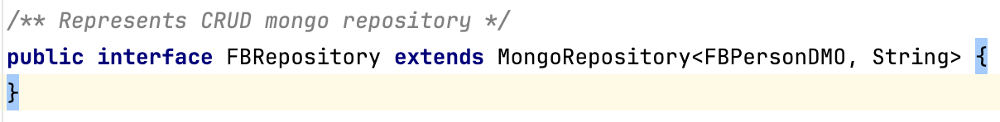
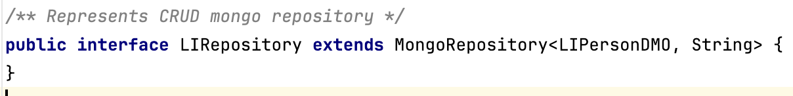
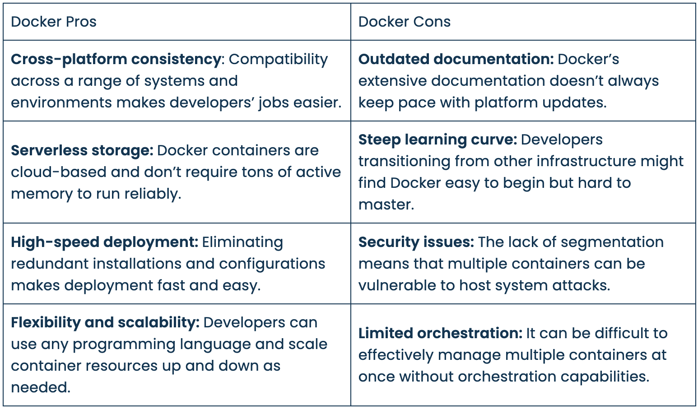
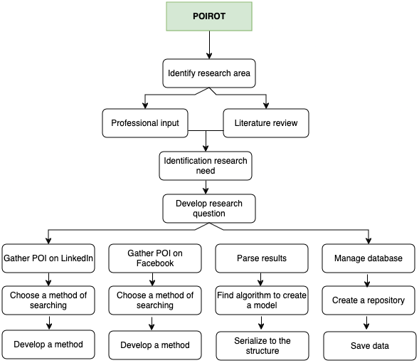
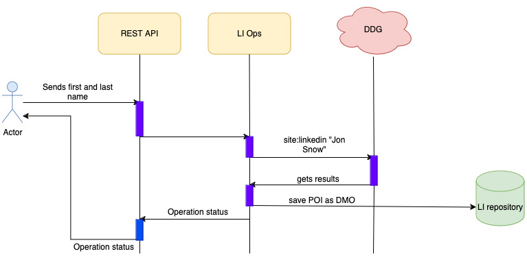

## Part A

1. Title Page

2. Abstract


# Table of contents
1. [Introduction](#introduction)
2. [Literature Review](#literature-review)
3. [Methodology](#Methodology)
4. [Results](#Results)
5. [Discussion](#Discussion)
6. [Conclusion](#Conclusion)
7. [References](#References)
8. [Appendices](#Appendices)

### Introduction

#### Background

Back to 2022, Russia treacherously invaded to Ukraine. Part of my family lives there. I was shocked, could not believe.
From the first minutes I started to read news from the available source. The news came in contradiction, one news said something, another one
the opposite. After a week of such reading, it became clear to me, that part of the news is fake, spread misinformation, present untrue facts.
Only "gut feelings" helps me somehow divide the wheat from the chaff. I realized that the current state of matter does not exist.
I simply wanted to get news and check if it is true or not.

#### Problem statement

Alghamdi (2023) explains: "The proliferation of fake news on social media platforms poses significant challenges to
society and individuals, leading to negative impacts. As the tactics employed by purveyors of fake news continue to evolve, 
there is an urgent need for automatic fake news detection (FND) to mitigate its adverse social consequences."

Machine Learning and Artificial Intelligence helps to fight back, in detecting fake news. They heavily depend on data.
However, all these methods analyzing text, using NLP or other available methods. Some of such methods are pretty good. 
Such approaches have drawbacks. They require having a lot of data, they require to be a data science to prepare data, to shape it.
In addition, this data is historical data. In the rise of chatGPT, creating a fake news it matters of seconds. News by nature changing.
To keep up with changes is a tremendous task and always it suceeds.

What if we gather information about person who spreads the news? It should be quicker and simplier. Two most popular social networks
may contain information related to the person of interest like location, profession, group(s), followers, phone and email, account date
creation. Some researches show that a public person is more likely not to spread fake information than a regular person. 

Knowing who is the person gives us a clue can this person spread a fake news or not, with probability between 0 and 1. 
It also could help to categorize a person if it is a human, bot, cyborg or troll.
Existing tools are cost money, often outdated or/and difficult to use. The following questions should be answered and pragmatic
steps to be implemented.
How does information related to POI look?
Is the information about POI the same on LinkedIn and Facebook?
Is gathering information legal? Is it ethical?
What are existing methods?
Web scrappping, how to extract data?
When search engine blocks the request, what can be done?
When Facebook sends http 999 error code, what does it mean?
What information helps to build a model? 
What database to choose?
How to store data?
How to retrieve data?
How to analyze data?
How to visualize data?


### Literature Review

To formulate the theory and resolve the research issues, a detailed literature review was executed. 
Access to journals and IEEE transactions was made possible via the servers of the University of People.
This section represents the litrerature in the field of full text search, machine learning, and data
gathering. The research focuses on finding a person of interest using publicly available sources, especially
those which are on social networks, like linkedIn and facebook. Most of the literature found on GS/IEEE 
concentrating their efforts on gathering information using cameras, mobile phones or other gadgets. 
There are not available trusted articles that could have been used to this research. In addition, because Facebook
changes their policies too often, any research older than one year ago becomes unrelevant.


Frogoso (2023) writes: "As many aspects of our lives depend on or exist only on the internet, we might be sharing 
information and details of our personal identities and private life without knowing."

To perform a searching of POI we have to start looking for official information related to our "target" it may be 
a location, phone number or email. LinkedIn is a valuable source of information which can give us a profession, location,
connections and groups a person is following. The date of creation of the account, number of follwers and groups can
differentiate a real person from the fake one. Having an email, adds the ability to check if this mail was pawned or not.
Location used as a filter to minimize the number of POIs.

#### Web Scrapping

Hillier (2021) defines a web scraping as: "Web scraping (or data scraping) is a technique used to collect content and data from the internet. 
This data is usually saved in a local file so that it can be manipulated and analyzed as needed. Common data types organizations collect include images, 
videos, text, product information, customer sentiments and reviews (on sites like Twitter, Yell, or Tripadvisor), and pricing from comparison websites."

Our use case of web scrapping is gathering information related to person of interest from search engine results.

#### Google Dorks

Jamie (2023) explains: "Google Dorking, also known as Google Hacking, is a technique used to find sensitive information or confidential data on the 
Internet by using advanced operators in Google search queries. These special operators make it possible to search for specific types of files or 
information. These files or information may be login pages, unsecured databases, and sensitive documents. This technique is helpful for many purposes, 
such as personal research, job applications, or even cybersecurity and penetration testing."

In our case:

```site:linkedin.com "Jon Snow"```

```site:facebook.com "Jon Snow"```

#### Document database

"A document database is a type of NoSQL database which stores data as JSON documents instead of columns and rows. JSON is a native language 
used to both store and query data. These documents can be grouped together into collections to form database systems. Using JSON enables app 
developers to store and query data in the same document-model format that they use to organize their app’s code. The object model can be 
converted into other formats, such as JSON, BSON and XML." (Williams, 2021).

Facebook Data Model



LinkedIn Data Model



#### MongoDB Spring Repository

"The central interface in the Spring Data repository abstraction is Repository. It takes the domain class to 
manage as well as the identifier type of the domain class as type arguments. This interface acts primarily as 
a marker interface to capture the types to work with and to help you to discover interfaces that extend this one." (Spring.io, 2024)

For Facebook data



For LinkedIn data




```CrudRepository``` interface defines basic database operations: Create, Read, Update and Delete.

Create operation saves entity into repository. 

Read operation finds one entity in the db and returns it. Search key may be ```id```

Update operation finds one entity, updates required fields and saves again.

Delete operation finds the entity and if it exists, deletes from the repository.

#### Facebook Page Scraper

The author of this library sP0t writes: "facebook-page-info-scraper is a Python package that provides a convenient way 
to crawl information from Facebook pages. With this package, you can scrape Facebook data with unlimited calls. Whether 
you're a researcher, a data enthusiast, or a developer working on Facebook-related projects, this library simplifies the 
data extraction process. It uses Selenium for web scraping and retrieves Facebook page details such as the page name, 
category, address, email, follower count, and more."

#### Microservice Architecture

Azure DevOps (2022) explains: "Microservices are a popular architectural style for building applications that are resilient, 
highly scalable, independently deployable, and able to evolve quickly."

Benefits:

* Agility — "Because microservices are deployed independently, it's easier to manage bug fixes and feature releases." (Azure DevOps 2022)
* Small, focused teams - "A microservice should be small enough that a single feature team can build, test, and deploy it. 
  Small team sizes promote greater agility." (Azure DevOps 2022)
* Small code base - "In a monolithic application, there is a tendency over time for code dependencies to become tangled. 
  Adding a new feature requires touching code in a lot of places." (Azure DevOps 2022)
* Mix of technologies - "Teams can pick the technology that best fits their service, using a mix of technology stacks as appropriate." (Azure DevOps 2022)
* Fault isolation - "If an individual microservice becomes unavailable, it won't disrupt the entire application, as long as 
  any upstream microservices are designed to handle faults correctly." (Azure DevOps 2022)
* Scalability - "Services can be scaled independently, letting you scale out subsystems that require more resources, 
  without scaling out the entire application. Using an orchestrator such as Kubernetes, you can pack a higher density of 
  services onto a single host, which allows for more efficient utilization of resources" (Azure DevOps 2022)
* Data isolation - It is much easier to perform schema updates, because only a single microservice is affected. (Azure DevOps 2022). 

Poirot is built on this principle. It has the following microservices:

* Poirot itself, rest API, controllers, scrapers and databse template.
* Facebook page Scrapper - a server which listens to upcoming requests and scraps FB pages.
* MongoDB a document database runs as independent microservice.

If needed, there is ability to scale up any of those services.


#### Docker

As mentioned in Docker documentation: "Docker is an open platform for developing, shipping, and running applications. Docker enables 
you to separate your applications from your infrastructure so you can deliver software quickly. With Docker, 
you can manage your infrastructure in the same ways you manage your applications. By taking advantage of Docker's methodologies 
for shipping, testing, and deploying code, you can significantly reduce the delay between writing code and running it in production."

In Poirot we use Docker because of:

DuploCloud (2023) put it this way:




## Part B

### Methodology

The implemented system Poirot is an intelligent system that assists to gather information about POI.
It aggregates available information on two social networks: LinkedIn and Facebook using open sources,
information that are public and available for everyone.

The purpose was to create a working system which will deal with hiding information about researcherss, 
to gather information on the internet, to parse such unstructured information, to build a model and save into 
reliable storage for the future use and analysis. 

To successfully tackle the defined objectives and sub-objectives, this research project undertakes a thorough 
exploration of important research questions. These inquiries are central to devising a feasible solution. 
This section provides an overview of how this research project was conducted, highlighting the steps taken 
throughout the process. A detailed flow diagram illustrating the main activities is presented in Figure 1.



The methodology outlines the intricate research steps represented in a flow chart, which were implemented to 
realize the research plan. It accentuates the systematic approach necessary to achieve the aims of this thesis 
and the important stages of the research initiative.

Initially, the idea was created by doing research of OSINT tools and methods of gathering information on person 
of interest. The bigger idea was and still is to find efficient methods and approaches to fignt with disinformation,
misinformation and spread of fake news. Knowing a person, knowing his presence on social networks, bounding to particular
groups, especially on Facebook gives as clues if this person could spread fake news intentionally, if it is a fake
account, or it is kind of bot, cyborg or troll. Once the scope of the problem was identified, stakeholders were contacted, informed.
The next step was revewing existing literature. With the help of Google Scholars, research questions were shaped and 
developed.
Then, choosing the right approach of searching data has beed examined. Available options were: to use FB & LI APIs
or find different methods. Having digged into their APIs became clear that part of the major requirements could not
meet. Then another idea was taken into account. What of to use Google Dorks queries to bring search resuls? It worked
as a charm, the only problem was - Google required to be logged in. However, DuckDuckGo provided the same functionalit 
anonymously. 

Literature review starts with understanding gathering methods using open sources, like the internet. It was concentrated
on the available tools, techniques and algorithms. The procedure illustrates the comprehensive research steps 
presented in a flow chart format, executed to fulfill the research plan. It emphasizes the sequential approach 
taken to reach the objectives of this thesis, as well as the significant phases of the research project.

Furthemore, literature review continues to subjects of machine learning, finding appropriate learning algorithms,
building training data and validation. Because of time constraints, this part is apart from the project.

### Results

After trials and errors the POIROT system was designed and implemented. The first concern was to use LI and FB
rest APIs which required to be subscribed. Once the subcription is approved (it may take some time), an application token is generated. 
In LinkedIn case is even worse. LI sends notification to a person saying that some search was perfomed. After understanding it
the direction was changed. In POIROT Google Dorks queries used. It was kind of breakthrough, it gives anonymity.
However, google itself does not allow to make searches without to be authorized. Doing brute force on trying each
search engine that accepts "Google Dorks" and allows anonymity leads to DuckDuckGo. But DDG after number of requests
puts a captcha. To overcome this problem, VPN is used. When DDG tries to ban a request, the VPN changes the IP/location.

When all such challenges were solved, the POIROT implemented, expending REST API for making requests about Person of Interest,
performs searches on both LI and FB social networks, then for each found result, makes direct connection to the web page,
then parses it. Extracted information mapped to data object model which at the end saved into database repository.
POIROT uses a document database, because the basic response from the social network is json. In addition a response
can be changed. And if some scale is required, to scale a document database is easier than relational one.

However, there are differences in gathering information from LinkedIn and Facebook. Facebook tries to make if difficult
to scrap web page. To handle this problem, POIROT uses additional microservice based on python library called ```facebook-page-info-scraper```.




### Discussion


### Conclusion

## Part C

### References

Carlos Fragoso (June, 2023) *How to Conduct Person of Interest Investigations Using OSINT and Maltego*
https://www.maltego.com/blog/how-to-conduct-person-of-interest-investigations-using-osint-and-maltego/


Yuval Harari (Oct. 2024) *Nexus*
https://files.catbox.moe/hedipq.pdf

Yiadh TLIJANI (April, 2024) 8 Deployment Strategies Explained and Compared
https://devopsbootcamp.org/8-deployment-strategies-explained-and-compared/


David Oragui. (2023, April 26). Software documentation best practices [with examples]. Helpjuice.
https://helpjuice.com/blog/software-documentation

Martin, M. (2023, April 8). Software configuration management in software engineering. Guru99.
https://www.guru99.com/software-configuration-management-tutorial.html

Sara Nguyen (Sep 20, 2023). A guide to understanding configuration management.
https://blog.logrocket.com/product-management/configuration-management-guide/


Alghamdi, J., Luo, S. & Lin, Y. A comprehensive survey on machine learning approaches for fake news detection. 
Multimed Tools Appl 83, 51009–51067 (2024). 
https://doi.org/10.1007/s11042-023-17470-8

Will Hillier (AUGUST 13, 2021) *What Is Web Scraping? A Complete Beginner’s Guide*
https://careerfoundry.com/en/blog/data-analytics/web-scraping-guide/

Jamie (January 20, 2023) *Beginner’s Guide to Hidden Data with Google Dorking*
https://dorksearch.com/blog/beginners-guide-google-dorking/

Alex Williams (May 13, 2021) *What is a Document Database?*
https://phoenixnap.com/kb/document-database

Spring.io
https://docs.spring.io/spring-data/mongodb/reference/repositories/core-concepts.html

sp0T wael-sudo2 *Free Facebook pages MetaData Scraping Library - Unlimited Calls*
https://github.com/wael-sudo2/facebook-page-info-scraper


Azure DevOps *Microservices architecture design*
https://learn.microsoft.com/en-us/azure/architecture/microservices/

Docker documentation *Get Started*
https://docs.docker.com/desktop/

DuploCloud (December 4 2023) *Docker Advantages and Disadvantages: What You Need to Know Before You Switch*
https://duplocloud.com/blog/docker-advantages-and-disadvantages/

### Appendices

### Acknowledge 

To my esteemed supervisor, Dr. Shuchi Dhir for her guidance and technical contributions, a heart of gratitude. 
She has already been a great mentor in addition to a supervisor. 

To University of People for giving me a chance to aquire a Master Degree in Information Technology providing
valuable courses and highly professional and knowledgeable lectures.


### List of Abriviations

**POI** Person Of Interest

**VPN** Virtual Private Network

**OSINT** Open Source Intelligence

**API** Application Programmable Interface

**DMO** Domain Model Object

### Problem Statement

### Literature Review

