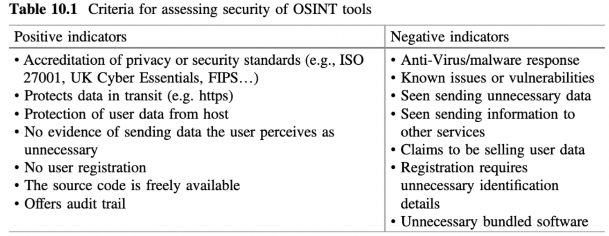

### Problem Statement

Recently, the world witnessed a new technical revolution, the rise of AI. The capabilities
of AI are enormous from context creation to person’s voice imitation. For a regular person
to understand what is true and what is generated is not possible. Russian hackers
influenced the US presidential election in 2016. They generated fake social accounts
and spread fake news to change the reality. Today it is much, much more difficult to
answer if something is fake or not. One of the steps in fighting fake news, disinformation
is to check who is sharing the news or spreading it over the social network. OSINT is
the way to go. The problem with it is - over the years it became outdated. The Intention of
my research is to find out a way to gather information based on a person's social
profile. Furthermore, Free OSINT and Online Research Resources help to find available
tools. It showed 18 resources, none of them relevant to gathering information about a
person. These tools are developed by different people with different intentions. Using
them without checking creates a security risk and loss of trust.
Using open source OSINT tools containing at least two problems. Claburn (2024)
explains: “The majority of open source project maintainers are not being paid for their
work, spend three times as much time on security than they did three years ago, and
have become less trusting of contributors following the xz backdoor. Small wonder then
that the maintainer population is aging – not enough newcomers want the
undercompensated, unappreciated job.”
The second problem as Revel (2016) suggests is

### Proposed solution

Using LinkedIn and Facebook REST API we are going to gather information related to social footprint 
of the person of interest. This information is saved into a database for further analysis.
Input: an user will provide the following: First Name, Last Name, Location, email and phone. 
Required parameters first name and last name. The rest are optional. A microservice gets this request 
and simultaneously sends requests to LinkedIn and Facebook. When user’s request finishes, 
notification will be sent by email.

There are two rest controllers, one related to the scraping data from LI and the second one, from FB.
Gathered information saved into a database for further usage. In both cases, LI and FB are required to be registered
in order to use their APIs, which do not fit our requirement to be in shadow. Thus, we will use search engine
like DDG and web scrapping techniques.

